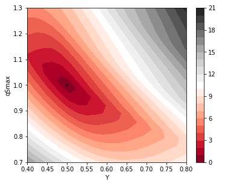

# BPL_TEST2_Batch_calibration

Material of standard text book model of batch cultivation where the model is calibrated using time series data for substrate and cell concentration. It is possible to upload your own batch data and calibrate the model for your data!

A bioprocess model need to be calibrated by estimating key process parameters. The model here has only three parameters $Y$, $qSmax$ and $Ks$, but the last parameter has little influence. The intial values $V_0$, $VX_0$ and $VS_0$ are given.

We use here methods that only need evaluation of the loss function for each tested parameter setting, thus does not use derivative information. These methods are collected in Python Scipy-package in the function scipy.optimize.minimize() and it is easy to change method and adjust parameters of the algorithm. The advantage with these methods is that you can easilty address more complex models wich has non-linearities and more parameters. The drawback is that optimization is more time consuming than methods that use derivative information. 

In Figure 1 below we see the results of fitting the model to simulated data and works perfectly well. Here parameters were given with min- and max-bounds. There are fewer methods that use bounds on parameters. Here we choose to work with Nelder-Mead since it is robust and commonly used for a loss function including experimental data.

**Figure 1** Simulation (solid liine) with estimated parameters compared to the data (asterix).

In Figure 2 we see the contour plot of the loss function, simplified by keeping the Ks-parameter value constant. Clearly there is a unique minima for the range of parameters considered. Further the contours has an ellipsoid-shape. The more narrow the form is the harder the parameter estimation problem is. In this case not too difficult. 

**Figure 2** Contour plot of the simplified loss function, keeping parameter Ks fixed. The final estimated parameters are marked (black +).

A Jupyter notebook that go through the parameter estimation and generate the figures above you have here
[start BPL notebook with PyFMI](https://colab.research.google.com/github/janpeter19/BPL_TEST2_Batch_calibration/blob/main/BPL_TEST2_Batch_calibration_colab.ipynb)
or alternatively (experimentally)
[start BPL notebook with FMPy](https://github.com/janpeter19/BPL_TEST2_Batch_calibration/blob/main/BPL_TEST2_Batch_calibration_fmpy_colab.ipynb).
In the menu choose Runtime/Run all. If you use the alternative notebook click symbol Open in Colab first.
The installation takes just a few minutes. The subsequent execution of all the simulations takes just about a minute or so.

License information:
* The binary-file with extension FMU is shared under the permissive MIT-license
* The other files are shared under the GPL 3.0 license
